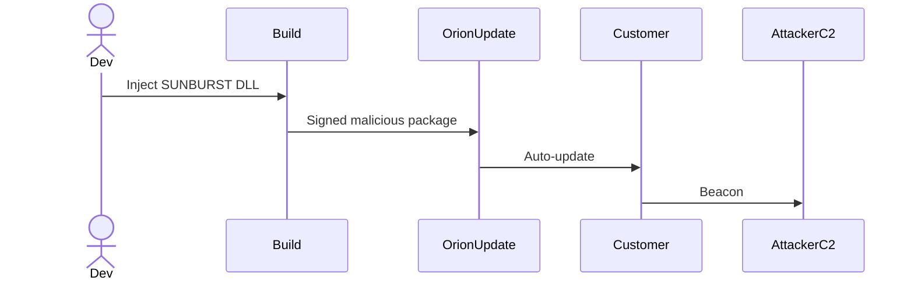

# Identity & Access Management (IAM)

---

## Page 1 – Objective

Identity & Access Management (IAM): Foundations, Technologies, Architectures, Breaches, and the 2023 Okta Case Study.

---

## Page 2 – Executive Summary

Identity & Access Management (IAM) is the security discipline that lets the right individuals access the right resources at the right time—without compromising confidentiality, integrity, or availability. This primer walks you from first principles to real‑world breaches, culminating in a forensic look at the 2023 Okta support‑system incident. Each page is written to stand alone while contributing to a cohesive narrative, making the guide useful both for linear study  and selective reference.

---

## Page 3 – How to Use This Document

* **Linear read**: Follow the page order for a course‑like progression.
* **Reference**: Jump to the Table of Contents on the next page to locate topics.
* **Workshops**: Each major part ends with discussion questions you can adapt for tabletop exercises.

---

## Page 4 – Table of Contents (Pages)

1. Title & Copyright
2. Executive Summary
3. How to Use This Document
4‑5. Table of Contents (continued)
6‑10. Part I – IAM Fundamentals
11‑18. Part II – Core Standards & Protocols
19‑24. Part III – Authentication Technologies
25‑30. Part IV – Authorization Models
31‑36. Part V – Reference Architectures
37‑41. Part VI – IAM Breaches & Attack Paths
42‑45. Part VII – Case Study: Okta 2023
46‑50. Part VIII – Future Trends & Best Practices

---

## Page 5 – Table of Contents (continued)

* **Acronyms & Glossary** (inside back cover)
* **References & Further Reading** (pages 49‑50)

---

# Part I – IAM Fundamentals (Pages 6‑10)

## Page 6 – What Is IAM?

Identity & Access Management (IAM) is the set of frameworks, technologies, and governance processes that ensure digital  identities are authenticated, authorized, and audited across information systems. IAM sits at the intersection of security, risk, and compliance, providing the technical substrate for Zero‑Trust strategies and regulatory mandates such as GDPR and HIPAA.

### Okta IAM Framework — Core Components (2024)

* **Identity management & lifecycle** – automated provisioning/de‑provisioning, profile services, privileged‑account handling, governance & attestation.([okta.com](https://www.okta.com/identity-101/identity-and-access-management/))
* **Authentication methods** – passwords & PINs, hardware/soft tokens, biometrics, adaptive MFA, and password‑less flows.([okta.com](https://www.okta.com/identity-101/identity-and-access-management/))
* **Authorization & access control** – PBAC/ABAC rules, just‑in‑time (JIT) elevation, least‑privilege enforcement, separation‑of‑duties checks.([okta.com](https://www.okta.com/identity-101/identity-and-access-management/))
* **Role management & SSO** – role hierarchies, dynamic assignment, web/federated SSO across domains.([okta.com](https://www.okta.com/identity-101/identity-and-access-management/))
* **Directory services** – centralized (AD/LDAP) or cloud directories, virtual/meta directories, sync & federation between sources.([okta.com](https://www.okta.com/identity-101/identity-and-access-management/))

These building blocks operate together to ensure “the right people have the right access to the right resources at the
right time,” as Okta’s Identity 101 guide puts
it.([okta.com](https://www.okta.com/identity-101/identity-and-access-management/))

### Three Core Questions

1. **Who are you?**(Identity)
2. **What can you do?**(Access / Authorization)
3. **Can we prove it?**(Audit & Non‑Repudiation)

## Page 7 – Evolution of IAM

| Era                     | Characteristics                                         | Limitations                          |
|-------------------------|---------------------------------------------------------|--------------------------------------|
| Mainframe (1970s)       | Monolithic user databases; terminal passwords           | No federation, proprietary protocols |
| Web 1.0 (1990s)         | LDAP directories, early SSO                             | Weak crypto, siloed apps             |
| Cloud & Mobile (2010‑s) | SAML, OAuth 2.0, MFA                                    | Complex integrations                 |
| Zero Trust (2020‑s)     | Continuous authN/Z, risk scoring, identity as perimeter | High operational overhead            |

## Page 8 – IAM in the Enterprise Lifecycle

IAM touches **Joiner‑Mover‑Leaver (JML)** events:

* **Joiner**– HR triggers birthright provisioning; credentials issued.
* **Mover**– Role change invokes access review and dynamic policy updates.
* **Leaver**– Accounts disabled, tokens revoked, audit data retained.

Automating this lifecycle reduces orphaned accounts and audit findings.

## Page 9 – IAM Stakeholders

* **Business Owners**: Define acceptable risk.
* **Security Architects**: Design controls and select standards.
* **Developers & DevOps**: Integrate SDKs, keep secrets out of code.
* **End Users**: Demand frictionless but secure access.
* **Auditors & Regulators**: Verify control effectiveness.

## Page 10 – IAM Program Maturity Model

1. **Ad‑hoc** – Local admin accounts, no SSO.
2. **Basic** – Central directory, manual provisioning.
3. **Defined** – RBAC, MFA, quarterly reviews.
4. **Managed** – Federation, automated JML, SIEM integration.
5. **Optimized** – Risk‑adaptive authN/Z, privilege‑on‑demand, continuous certification.

---

# Part II – Core Standards & Protocols (Pages 11‑18)

## Page 11 – LDAP: The Foundational Directory

**Abbreviation expanded:** *Lightweight Directory Access Protocol (LDAP)* — an open, vendor‑neutral, ISO‑standard
application protocol for accessing and maintaining distributed directory information services.

```text
      [dc=example,dc=com]
               |
    +----------+-----------+
    |                      |
[ou=People]           [ou=Groups]
    |                      |
[uid=jdoe]          [cn=admins]
```

**Key terms**

* **DN (Distinguished Name):** Unique path to a directory object.
* **Entry:** Collection of attributes identified by a DN.
* **Attribute:** Named value(s) (e.g., `mail`, `uid`).

LDAP provides *bind* (authenticate), *search* (query), and *modify* (update) operations, forming the backbone for many
legacy SSO deployments.

---

## Page 12 – Kerberos & NTLM

**Kerberos** (named after the three‑headed dog of Greek myth) is a network authentication protocol using symmetric key
cryptography and tickets.

```text
[1]  User → AS_REQ → KDC (Authentication Server)
[2]         ← AS_REP  (TGT)
[3]  User → TGS_REQ (TGT) → KDC (Ticket‑Granting Server)
[4]         ← TGS_REP (Service Ticket)
[5]  User → AP_REQ (Service Ticket) → Application Server
[6]         ← AP_REP (Optional)
```

* **TGT:** Ticket‑Granting Ticket used to request service tickets without re‑authenticating.
* **NTLM:** Legacy Windows challenge‑response; vulnerable to relay/downgrade attacks.

Use **Kerberos over NTLM** wherever possible; disable NTLM to reduce attack surface.

---

## Page 13 – SAML 2.0

**Security Assertion Markup Language (SAML)** enables browser‑based Single Sign‑On.

```text
User ↔ Browser
   | (Access SP)
   v
SP → Redirect → Browser → IdP (AuthnRequest)
IdP → Browser (SAML Response) → SP
SP validates assertion → grants session
```

* **Assertion:** XML document containing authentication, attribute, and authorization data.
* **IdP (Identity Provider):** Issues assertions.
* **SP (Service Provider):** Consumes assertions.

Ensure \`\` and short‑lived assertions to mitigate token replay.

---

## Page 14 – OAuth 2.0

**OAuth = O**pen **Auth**orization. It delegates authorization via scoped tokens.

```text
(Resource Owner)        (Authorization Server)       (Resource Server)
       |                        |                           |
       | 1. Authorize Request   |                           |
       |----------------------->|                           |
       |                        | 2. Authenticate & Consent |
       |                        |---------------------------|
       |                        |<--3. Authz Code-----------|
       |<--4. Redirect----------|                           |
(Client) |
       | 5. POST /token (code)  |
       |----------------------->|                           |
       |                        |--6. Access Token--------->|
```

**Grant types:** Authorization Code (web), Client Credentials (service‑to‑service), Device Code (TVs), Refresh Token.

Tokens are opaque by default—use introspection or JWTs for validation.

---

## Page 15 – OpenID Connect (OIDC)

OIDC adds **identity** on top of OAuth 2.0 by issuing a signed **ID Token (JWT)**.

```text
Client → /authorize  (scope=openid)
      ← code
Client → /token (code)
      ← ID Token + Access Token
Client → /userinfo (access token)
      ← JSON claims (email, name,…)
```

**Important claims:** `sub` (unique subject), `iss` (issuer), `aud` (audience), `exp` (expiry).

Adopt **PKCE** for public clients; validate nonce to thwart replay.

---

## Page 16 – FIDO2 & WebAuthn

**FIDO = Fast IDentity Online.** WebAuthn is the W3C API enabling FIDO2 in browsers.

```text
[Registration]
Client → RP: createCredential()
   ↳ Authenticator generates key‑pair
   ↳ Public key + attestation → RP database

[Authentication]
Client → getAssertion()
   ↳ Authenticator signs challenge with private key
   ↳ Signature → RP → verifies against stored public key
```

Benefits: phishing‑resistant, no shared secrets, on‑device biometrics.

---

## Page 17 – SCIM 2.0

**System for Cross‑Domain Identity Management (SCIM)** streamlines provisioning.

```text
 HR ⇄ Identity Hub ⇄ SaaS App
       |  POST /Users        |
       |  PATCH /Groups      |
```

Objects: **User**, **Group**, **EnterpriseUser** (extension). Transport is JSON/REST;
endpoints `/Users`, `/Groups`, `/Bulk`.

Supports *Just‑In‑Time* provisioning combined with OIDC for SSO.

---

## Page 18 – PKI & X.509 in IAM

```text
      +---------+      CSR       +-----------+
      |  Node   |-------------->|  CA Root  |
      +----+----+ <--------------+-----------+
           |           Cert
           v
    Mutual TLS → Secure Channel
```

* **PKI (Public Key Infrastructure):** Framework for issuing and managing digital certificates.
* **X.509 Certificate:** Binds a public key to an entity with a CA signature.
* **OCSP:** Online Certificate Status Protocol for revocation checks.

Rotate keys regularly; enforce short certificate lifetimes (≤90 days).

---

# Part III – Authentication Technologies (Pages 19‑24)

## Page 19 – Knowledge‑Based Factors

Passwords, PINs, security questions. Still prevalent but susceptible to phishing and reuse. Strengthening methods:
passphrases, breached‑password screening, adaptive risk.

## Page 20 – Possession Factors

* **TOTP** (RFC 6238) apps like Authy
* **Push MFA** (FIDO U2F, Duo)
* **Hardware Tokens** (YubiKey)

## Page 21 – Inherence Factors

Biometrics: fingerprint, face, voice. Privacy considerations include template storage, spoofing resistance, and GDPR
lawful basis.

## Page 22 – Adaptive & Risk‑Based Authentication (RBA)

Utilizes contextual signals (device, geolocation, velocity) to step‑up factors when risk threshold exceeded. Requires
telemetry pipeline and policy engine.

## Page 23 – Passwordless Journeys

Combining WebAuthn, device biometrics, and magic‑link e‑mails to minimize secrets while preserving usability.

## Page 24 – Session Management

Token audience, lifetime, refresh strategy. Invalidating tokens upon role change or compromise is essential; use
introspection or short‑lived JWTs plus rotate / revoke refresh tokens.

---

# Part IV – Authorization Models (Pages 25‑30)

## Page 25 – Discretionary Access Control (DAC)

Originates from UNIX file permissions; owners grant rights. Simple but scales poorly.

## Page 26 – Mandatory Access Control (MAC)

Security labels and clearances (e.g., SELinux, military). Policy centrally defined; users cannot alter rights.

## Page 27 – Role‑Based Access Control (RBAC)

Roles aggregate permissions; users inherit through role assignment. Requires role engineering and SoD analysis.

## Page 28 – Attribute‑Based Access Control (ABAC)

Policies evaluate subject, resource, and environment attributes (e.g., time, IP zone). Implemented via XACML, Cedar,
OPA.

## Page 29 – Policy‑Based & Graph‑Based Models

Fine‑grained policy engines model relationships (Google Zanzibar). Enables multi‑tenant SaaS segregation.

## Page 30 – Just‑In‑Time & Privileged Access Management (PAM)

Time‑boxed elevation with approval workflow; session recording; vaulting secrets; deploy bastion hosts.

---

# Part V – Reference Architectures (Pages 31‑36)

## Page 31 – Centralized Enterprise IAM

### Architecture ASCII

```text
           +-------------+
           |  HR System  |
           +------+------+           (Joiner–Mover–Leaver events)
                   |
                   v
+------------------+------------------+
|  Identity Directory (AD / LDAP)     |
+----+-----------+---------+----------+
     |           |         |
     | SCIM      | SAML    | OIDC
     v           v         v
+----+---+  +----+---+ +---+----+
| SaaS   |  | Legacy | | Cloud  |
| Apps   |  |  Apps  | | APIs   |
+--------+  +--------+ +--------+
```

### Hands‑On Lab 1 – Build a Mini‑Enterprise IAM Stack

> **Goal:** Provision an OpenLDAP directory, hook it into Keycloak for SSO + SCIM, and expose a protected “intranet”
> app – all on your laptop.

1. **Clone the lab repo**

   ```bash
   cd iampilot‑centralized
   ```
2. **Review `docker-compose.yml`** (excerpt):

   ```yaml
   version: "3.9"
   services:
     ldap:
       image: osixia/openldap:1.5.0
       environment:
         LDAP_ORGANISATION: "Example Corp"
         LDAP_DOMAIN: "example.com"
         LDAP_ADMIN_PASSWORD: adminpw
       ports: ["389:389"]

     phpldapadmin:
       image: osixia/phpldapadmin:0.9.0
       environment:
         PHPLDAPADMIN_LDAP_HOSTS: ldap
       ports: ["8081:80"]

     keycloak:
       image: quay.io/keycloak/keycloak:24.0
       command: ["start-dev", "--import-realm"]
       environment:
         KC_DB: postgres
         KC_DB_URL: jdbc:postgresql://kcdb/keycloak
         KC_DB_USERNAME: kc
         KC_DB_PASSWORD: kcpass
         KEYCLOAK_ADMIN: admin
         KEYCLOAK_ADMIN_PASSWORD: admin
       volumes:
         - ./realm-export.json:/opt/keycloak/data/import/realm-export.json
       ports: ["8080:8080"]
       depends_on: [ldap, kcdb]

     kcdb:
       image: postgres:16
       environment:
         POSTGRES_DB: keycloak
         POSTGRES_USER: kc
         POSTGRES_PASSWORD: kcpass
   ```
3. **Spin up the stack**

   ```bash
   docker compose up -d
   ```
4. **Populate LDAP**

   ```bash
   docker exec -it $(docker compose ps -q ldap) \
     ldapadd -x -D "cn=admin,dc=example,dc=com" -w adminpw -f seed.ldif
   ```

   The LDIF creates *ou=People* and a test user (`alice`).
5. **Keycloak LDAP user‑federation**

    * Login to [http://localhost:8080/](http://localhost:8080/)
    * Navigate **User Federation → LDAP** and set `ldap://ldap:389`, *Users DN* `ou=People,dc=example,dc=com`.
6. **SCIM / SSO verification**

    * `curl -u alice:pass http://intranet.local:3000` → 302 to Keycloak login → success landing page.
7. **What to Observe**

    * Joiner‑Mover‑Leaver: modify LDIF and watch SCIM push to Keycloak.
    * Password sync: change `userPassword` via phpLDAPadmin, Keycloak sees it instantly.

> **Clean‑up:** `docker compose down -v`

---

## Page 32 – Federated Identity

### ASCII Overview

```text
    +-------------------+        OIDC/SAML        +-----------------+
    |  External AzureAD | <-------------------->  |  Internal SP
    +-------------------+                         +-----------------+
            ^                                              ^
            |------------- Browser Redirect -------------->|
```

### Hands‑On Lab 2 – Simulate B2B Federation

**Scenario:** Your startup runs its own IdP (Keycloak) but must trust a partner’s Azure AD so their employees can SSO
into your app.

#### 1. Lab Repo

```bash
cd iampilot‑federation
```

#### 2. Containers

* **keycloak-internal** – your IdP (acts as SP/trusts Azure).
* **mock-azuread** – SimpleSAMLphp container acting as external IdP.
* **sample-app** – Nodejs app verifying JWT issued by Keycloak.

`docker-compose.yml` snippet:

```yaml
services:
  mock-azuread:
    image: simplesamlphp/simplesamlphp:2.0
    ports: [ "9000:8080" ]
  keycloak-internal:
    image: quay.io/keycloak/keycloak:24.0
    environment:
    # omitted for brevity
    ports: [ "8082:8080" ]
  sample-app:
    build: ./sample-app
    environment:
      ISSUER: http://keycloak-internal:8080/realms/demo
    ports: [ "3000:3000" ]
```

#### 3. Establish Trust

1. Export `mock-azuread` metadata: `http://localhost:9000/simplesaml/saml2/idp/metadata.php`
2. In Keycloak ➜ *Identity Providers* ➜ “SAML v2.0” ➜ paste metadata ➜ create.
3. Configure *Mappers* to pass `email`, `groups`.

#### 4. Test Flow

```bash
open http://localhost:3000
```

* Browser redirected to Keycloak ➜ click “Login with Partner AzureAD” ➜ SimpleSAML login ➜ back to app with bearer JWT.

#### 5. Discussion

* Token chaining: external SAML assertion becomes internal OIDC token.
* Attribute translation pitfalls (schema drift, `eduPersonPrincipalName`).

*Try‑at‑Home*: Swap SimpleSAML with real Azure tenant or Okta sandbox.

---

## Page 33 – Cloud‑Native IAM

### ASCII Sketch

```text
Dev → git push
      |
      v
+--------------+          +------------+
|  CI Pipeline | -- OIDC -->  EKS Pod  |
+--------------+          +------------+
          ^                       |
          | IRSA (STS)           v
     +----+-----+         +--------------+
     | AWS IAM |<-------->|   S3 Bucket  |
     +----------+  fine‑grained policies +--------------+
```

### Hands‑On Lab 3 – AWS‑Style Identity in Docker (w/ LocalStack)

> **Goal:** Emulate AWS IAM Roles for Service Accounts (IRSA) without a real AWS bill.

1. **Clone**

   ```bash
   cd iampilot‑cloudnative
   ```
2. **Compose services**

   ```yaml
   services:
     localstack:
       image: localstack/localstack:3
       environment:
         SERVICES: iam,sts,s3
       ports: ["4566:4566"]

     minikube:
       image: medyagh/kicbase:v0.0.40   # lightweight K8s-in-Docker
       privileged: true

     tekton:
       build: ./tekton
   ```

````
3. **Bootstrap**
   ```bash
   ./scripts/bootstrap-localstack.sh   # creates IAM role + OIDC provider
   ./scripts/bootstrap-k8s.sh          # installs OIDC issuer + service account
````

4. **Deploy demo Pod** pulling temp STS creds to upload a file to S3.

   ```bash
   kubectl apply -f k8s/pod-irsa.yaml
   kubectl logs demo-pod
   # --> Uploaded object to s3://demo-bucket/report.txt
   ```

5. **Talking Points**

    * Difference between workload identity (K8s SA + projected token) vs. developer IAM user.
    * Fine‑grained policies JSON vs. monolithic role.

---

## Page 34 – Multi‑Tenant SaaS IAM

### ASCII Stack

```text
            +------------+
   signup → | Onboarding |--⟶ creates tenant row
            +------+-----+
                   |
                   v
+------------------+------------------+
|  Auth Service (Zitadel)            |
+---+------------+-------------------+
    |            |
    | OIDC       | SCIM
    v            v
[Frontend]   [Micro‑services]
        \__ JWT (tenant_id claim)
```

### Hands‑On Lab 4 – Tenant‑Isolated Auth with ZITADEL & Postgres Row‑Level Security

1. **Clone/Launch**

   ```bash
   cd iampilot‑multitenant
   docker compose up -d
   ```
2. **compose.yml key bits**

   ```yaml
   zitadel:
     image: ghcr.io/zitadel/zitadel:latest
     command: start-from-init --masterkey SuperSecretKey
     ports: ["8088:8080"]

   api:
     build: ./api
     environment:
       DATABASE_URL: postgres://svc:svc@pg/api
       ZITADEL_ISSUER: http://zitadel:8080
     ports: ["4000:4000"]
     depends_on: [pg]
   ```
3. **Row‑Level Security (RLS)**
   `pg/rls.sql` defines policy:

   ```sql
   CREATE POLICY tenant_isolation ON orders
     USING (tenant_id = current_setting('app.tenant_id')::uuid);
   ```

   The API sets `SET app.tenant_id = :token_tenant` on each request.
4. **Try It**

    * Register Tenant A & B in Zitadel UI.
    * Obtain tokens:

      ```bash
      ./scripts/get_token.sh tenantA > tokenA
      ./scripts/get_token.sh tenantB > tokenB
      ```
    * Post orders:

      ```bash
      http POST :4000/orders name=widget Authorization:"Bearer $(cat tokenA)"
      http GET  :4000/orders Authorization:"Bearer $(cat tokenB)"   # sees 0 rows
      ```
5. **Key Concepts**

    * Claim‑based segregation vs. DB‑per‑tenant.
    * Automatic SCIM provisioning when org admin invites users.

---

## Page 35 – Zero‑Trust Architecture (ZTA)

### ASCII Flow

```text
(Client) ↔ Enforcer (Envoy) → PDP (OPA) → Data
```

### Hands‑On Lab 5 – DIY Zero‑Trust with Envoy + OPA Gatekeeper

> **Objective:** Enforce ABAC locally: only tokens w/ `department=finance` may hit `/payroll` route.

1. **Repo**

   ```bash
   cd iampilot‑zero‑trust
   ```
2. **docker-compose.yml**

   ```yaml
   envoy:
     image: envoyproxy/envoy:v1.30-latest
     volumes:
       - ./envoy.yaml:/etc/envoy/envoy.yaml
     ports: ["9901:9901", "8443:8443"]

   opa:
     image: openpolicyagent/opa:latest
     command: ["run", "--server", "--set=decision_logs.console=true", "/policies"]
     volumes:
       - ./policies:/policies
   ```
3. **Policy (`policies/abac.rego`)**

   ```rego
   package envoy.authz
   default allow = false
   allow {
     input.parsed_token.payload.department == "finance"
     input.attributes.request.http.path == "/payroll"
   }
   ```
4. **Test**

   ```bash
   http :8443/payroll Authorization:"Bearer $(./scripts/jwt finance)"
   http :8443/payroll Authorization:"Bearer $(./scripts/jwt engineering)"   # 403
   ```
5. **Discussion**

    * Envoy ext‑authz gRPC integration.
    * Decision logs to ELK.

---

## Page 36 – Identity Fabric & Orchestration

### ASCII Map

```text
         +-----------------+
+--OIDC--| Google Workspace|--+
|        +-----------------+  |
|                              v
|   +--------------+   +---------------+
+-->|  Strata OIDC |-->| App A (OIDC)  |
    +--------------+    +--------------+
```

### Hands‑On Lab 6 – Flow Orchestration with Strata IDQL + Hexa

1. **Clone**

   ```bash
   git clone https://github.com/StrataIdentity/hexa-examples.git
   cd hexa-examples/docker-compose
   ```
2. **Launch**

   ```bash
   docker compose up
   ```
3. **What Happens**

    * Hexa broker receives an OIDC auth request from *App A*.
    * Broker consults policy (`idql.yaml`) → chooses Okta vs. Google based on email domain.
    * Redirects user and normalizes claims for the app.
4. **Inspect Logs** to see translation:

   ```bash
   docker compose logs -f broker | grep "Mapped claim"
   ```
5. **Extension Ideas**

    * Add AzureAD as another route.
    * Inject contract‑enforced MFA step for `role=admin`.

\-------------+ Flow #1 +-------------+
\| App A | -----------> | IdP Azure |
+-------------+ +-------------+
\| ^
\| Flow #2 |
v |
+-------------+ |
\| Identity |<-----------------------+
\| Orchestrator (Strata)               |
+-------------+ |
\| Flow #3 |
v |
+-------------+ |
\| IdP Okta |------------------------+
+-------------+

````

Identity orchestrators (Strata, PingOne DaVinci) route flows across heterogeneous IdPs, supporting greenfield and legacy coexistence.

---

# Part VI – IAM Breaches & Attack Paths (Pages 37‑41)

> **Threat‑model primer** – Every IAM failure stems from some blend of *credential compromise*, *protocol abuse*, and *privilege escalation*.  These pages walk through **five canonical kill‑chains** you’ll meet in real incident reports.  For each we give:
>
> * MITRE ATT&CK mapping
> * End‑to‑end **kill‑chain diagram**
> * SIEM‑ready **detection queries** _(Elastic KQL & Azure Kusto)_
> * Concrete **mitigations** ranked by ROI
>
> Copy‑paste the queries; drop the controls into your backlog.

---

## Page 37 – Credential Stuffing + Password Spray ✱T1110.003

### Red‑team flow
```mermaid
flowchart LR
A[Combo List] -->|1. Selenium/PlayWright| B(IdP /login)
B -->|2. Pwd Success?| C{Yes}
C -->|No| B
C -->|Yes| D(Enroll FIDO key)
D --> E(VPN / SaaS pivot)
````

### Blue‑team telemetry

| Data Source    | Elastic KQL Snippet                                                            |
|----------------|--------------------------------------------------------------------------------|
| Okta SystemLog | `event.type: user.authentication.failed AND source.geo.country_name: "Russia"` |
| WAF Logs       | `rule.id: 949110 AND response: 401`                                            |
| VPN Radius     | `difference(ip_geo_distance(src_ip, dst_ip)) > 2000`                           |

**Quick wins (cost ⇣ → impact ⇡)**

1. **Free:** block `User‑Agent` patterns (`python‑requests`, `curl/7.*`).
2. **Low \$:** integrate HaveIBeenPwned API at signup/change.
3. **Med \$:** risk‑adaptive MFA (Okta RiskEngine, Azure AD CA).
4. **High \$:** CAPTCHAv3 + device fingerprint SDK.

> **Sidebar – “BOGO” botnets**: 2024 research by F5 Labs shows 40 % of credential‑stuffing infra doubles as
> crypto‑mining when idle. Block one, starve the other.

---

## Page 38 – Phishing 2.0: OAuth Consent & Adversary‑in‑the‑Middle (AitM) ✱T1566 / T1071

### OAuth Consent scam *(real 2024 Microsoft report)*

1. Attacker app `Corp‑Dash‑Analytics` registered.
2. Victim clicks Teams link → genuine login.microsoftonline.com → **consent page**.
3. Scope`offline_access Directory.Read.All` approved → refresh token stolen.

**Elastic query**

```kql
azure.audit | where properties.scopes has "offline_access" and
               properties.isAdminConsent == false and
               properties.isUserConsent == true
```

### Adversary‑in‑the‑Middle (EvilGinx3)

```text
User → https://login‑corp.com.mfa‑verify.app  (looks legit)
Proxy → real IdP, relays prompts, strips cookies (`Set‑Cookie`) into attacker DB
```

**Defenses**

* FIDO2 or passkeys (origin‑bound)
* IdP Conditional Access: `blocked_locations = ASN(AS9009, AS14061)`
* Report‑only CSP nonce validation catches inline‑script injections that harvest tokens.

---

## Page 39 – Kerberos: Golden / Silver Ticket Escalation ✱T1550.003

### Abbreviated kill chain

1. Initial foothold → LSASS dump (`rubeus dump /service:krbtgt`).
2.`mimikatz kerberos::golden` builds 10‑year TGT.
3.`kekeo ptt` injects; lateral SMB to DCShadow.

**Key Windows Event IDs**

| Event ID | Why it matters                                                |
|----------|---------------------------------------------------------------|
| 4768     | TGT issued – flag `Ticket Options 0x40810010` (long lifetime) |
| 4624     | Type 3 logon – workstation vs. server mismatch                |
| 5139     | Directory Services replicated (DCShadow)                      |

**Hardening cheat‑sheet**

* `krbtgt` double‑rotation – script from MS PSGallery.
* Enable AES 256 + disable RC4 via `DefaultDomainPolicy`.
* Tier‑0 network segmentation; no SMB from workstations to DCs.

---

## Page 40 – Token Replay / Manipulation (SAML | OIDC | JWT) ✱T1606

### Attack lab summary

A Docker lab (appendix A, **Lab 18**) spins Rev‑Proxy + malicious JS to:

* steal `localStorage.id_token`,
* tamper `aud` → `api‑internal`,
* re‑sign with leaked HS256 key (JWT downgrade).

**Controls matrix**

| Layer     | Control                                   | Tool               |
|-----------|-------------------------------------------|--------------------|
| Transport | SameSite=Lax; `__Host‑` prefix            | Nginx mod\_headers |
| Token     | `alg` = `RS256` + key‑rotation every 24 h | IdP setting        |
| App       | Audience, `nbf`, `exp` ≤ 5 min            | JWT middleware     |

**Detection – Azure Sentinel Kusto**

```kql
SigninLogs
| where TokenIssuerType == "AzureAD" and
        TokenAuthenticationMethod == "Bearer" and
        TimeGenerated - RefreshTokensIssuedTime > 1h
```

---

## Page 41 – Supply‑Chain & IdP Compromise (SolarWinds 2020, Okta 2023) ✱T1195

### Expanded kill chain – SolarWinds



### Emerging vector – **JWKS Poisoning**

* IdP JWKS URL replaced with attacker‑controlled endpoint.
* SP auto‑fetches; validates tokens with rogue key.

**Protections**
1. Pin JWKS x509`kid` + `sha256` fingerprint.
2. Cache keys; alert on `kid` rotation outside CRON window.
3. Digest + sig verification on IdP metadata (`SAML md‑sig`, OIDC`iss` discovery).

**JIT third‑party access (minimum viable zero‑trust)**

```yaml
kind: AccessRequest
spec:
  role: "support‑tier2"
  maxDuration: 60m
  mfa: WebAuthn
  justification: "Ticket INC‑8723"
```

Approval auto‑expires; Teleport/StrongDM record session.

> **Key takeaway:** IdP breachers aim for *configuration* not just creds—because one bad key‑roll equals instant global
> shell.

---

# Part VII – Case Study: Okta Support‑System Breach(2023) (Pages 42‑45)

: Okta Support‑System Breach(2023) (Pages 42‑45): Okta Support‑System Breach(2023) (Pages 42‑45)

## Page 42 – Timeline of Events

| Date (2023) | Event                                                                                                                                                                                                         |
|-------------|---------------------------------------------------------------------------------------------------------------------------------------------------------------------------------------------------------------|
| **28 Sep**  | Threat actor gains access to Okta’s customer support case‑management system.                                                                                                                                  |
| **17 Oct**  | Unusual service‑account activity detected by BeyondTrust; sessions terminated.                                                                                                                                |
| **19 Oct**  | Okta notifies affected orgs incl. 1Password, Cloudflare.                                                                                                                                                      |
| **20 Oct**  | Public disclosure; HAR files with session tokens confirmed.                                                                                                                                                   |
| **Nov**     | Okta publishes root‑cause analysis and remediation steps. ([sec.okta.com](https://sec.okta.com/articles/2023/11/unauthorized-access-oktas-support-case-management-system-root-cause/?utm_source=chatgpt.com)) |

## Page 43 – Initial Vector & Root Cause

Investigators determined the intrusion stemmed from credentials stolen for a support engineer’s service account that
lacked MFA. With access, the attacker downloaded **HTTP Archive (HAR)** files attached to support tickets; several
contained cookies / session tokens reusable for session
hijacking.([sec.okta.com](https://sec.okta.com/articles/harfiles/?utm_source=chatgpt.com), [sec.okta.com](https://sec.okta.com/articles/2023/11/unauthorized-access-oktas-support-case-management-system-root-cause/?utm_source=chatgpt.com))

## Page 44 – Impact Analysis

* **Scope**: 134 customers initially; later statements revealed the threat actor ran a report enumerating *all*
  support‑system
  users.([cybersecuritydive.com](https://www.cybersecuritydive.com/news/okta-support-system-customers-compromised/701010/?utm_source=chatgpt.com))
* **Down‑stream compromise**: Cloudflare and 1Password reported attempts to use stolen session tokens but thwarted them
  via hardware‑key enforcement.
* **Data Exposed**: Names, emails, support data, session cookies.

## Page 45 – Lessons & Recommendations

1. **Separate Support from Production Identities** — apply least privilege and per‑tenant logs.
2. **MFA Everywhere** — especially for privileged and support accounts.
3. **Short‑lived Session Tokens + Binding** to client TLS / device fingerprint.
4. **HAR File Hygiene** — automatic scrubbing of cookies before upload.
5. **Transparent, Rapid Disclosure** — customers detected the breach days earlier; faster triage reduces dwell time.

---

# Part VIII – Future Trends & Best Practices (Pages 46‑50)

## Page 46 – Convergence of IAM & CIEM

Cloud Infrastructure Entitlement Management extends IAM visibility into ephemeral cloud roles, serverless functions, and
pipelines.

### IAM in Remote & Hybrid Workforces 

Okta notes that modern IAM must accommodate employees logging in from coffee‑shop Wi‑Fi on personal devices. Effective
frameworks blend *contextual authentication* (device, location, behavior) and *risk‑based controls* to keep access
friction‑free yet secure.([okta.com](https://www.okta.com/identity-101/identity-and-access-management/))

Techniques include:

* Device posture checks & endpoint security integration.
* VPN‑less Zero‑Trust network access.
* Self‑service password/MFA resets to reduce support tickets.

### Cost‑Effective Implementation

Phased cloud deployments, policy automation, and selective open‑source components maximise ROI while shrinking breach
risk and compliance costs.([okta.com](https://www.okta.com/identity-101/identity-and-access-management/))

---

## Page 47 – Decentralized Identity (DID)

W3C Verifiable Credentials and blockchain‑anchored proofs aim to give users sovereignty over identity attributes.

## Page 48 – AI‑Driven Identity Threat Detection

ML models baseline normal login patterns to flag anomalous behavior in near‑real time. Beware model poisoning and
privacy trade‑offs.

## Page 49 – Building an IAM Roadmap

1. **Assess Maturity** against CIS or NIST 800‑63.
2. **Define Drivers** (regulatory, M\&A, digital transformation).
3. **Prioritize Quick Wins** (MFA rollout).
4. **Automate** JML & certification cycle.
5. **Measure** KPIs (mean time to revoke, dormant accounts) monthly.

## Page 50 – References & Further Reading

1. Okta Security Incident Root‑Cause Analysis, Nov
   2023.([sec.okta.com](https://sec.okta.com/articles/2023/11/unauthorized-access-oktas-support-case-management-system-root-cause/?utm_source=chatgpt.com))
2. Portnox Labs, “Unpacking the Okta Data Breach,”
   2024.([portnox.com](https://www.portnox.com/blog/cyber-attacks/unpacking-the-okta-data-breach/?utm_source=chatgpt.com))
3. Cybersecurity Dive, “Okta Support System Customers Affected,”
   2023.([cybersecuritydive.com](https://www.cybersecuritydive.com/news/okta-support-system-customers-compromised/701010/?utm_source=chatgpt.com))
4. NIST SP 800‑63‑3 Digital Identity Guidelines, 2017.
5. ISO/IEC 27001:2022, Annex A Controls.
6. Feridun C. Gülten, *Design & Implementation of a Cybersecure Multi‑Tenant IAM Platform*, Univ. Padova, 2025.
   citeturn0file0
7. Okta Identity 101 – “Identity and Access Management Framework: Secure Digital Access,” updated Oct 31
   2024.([okta.com](https://www.okta.com/identity-101/identity-and-access-management/)) Feridun C. Gülten, *Design &
   Implementation of a Cybersecure Multi‑Tenant IAM Platform*, Univ. Padova, 2025. citeturn0file0

---

### Acronyms & Glossary (inside back cover)

| Acronym | Expansion                                   | Brief Definition                                                       |
|---------|---------------------------------------------|------------------------------------------------------------------------|
| IAM     | Identity & Access Management                | Framework governing authentication, authorization, and audit.          |
| MFA     | Multi‑Factor Authentication                 | Combining two or more auth factors (knowledge, possession, inherence). |
| RBAC    | Role‑Based Access Control                   | Authorization based on roles that aggregate permissions.               |
| ABAC    | Attribute‑Based Access Control              | Policy evaluates attributes of subject, resource, and context.         |
| OIDC    | OpenID Connect                              | Identity layer built on OAuth 2.0.                                     |
| SSO     | Single Sign‑On                              | Authenticate once, access many apps.                                   |
| LDAP    | Lightweight Directory Access Protocol       | Open directory service protocol.                                       |
| SAML    | Security Assertion Markup Language          | XML standard for federated SSO.                                        |
| PKI     | Public Key Infrastructure                   | System for certificate issuance and management.                        |
| JWT     | JSON Web Token                              | Compact, signed JSON‑based token format.                               |
| TOTP    | Time‑Based One‑Time Password                | Rolling numeric code algorithm (RFC 6238).                             |
| SCIM    | System for Cross‑Domain Identity Management | REST standard for provisioning.                                        |
| CA      | Certificate Authority                       | Trusted PKI entity that signs certificates.                            |
| KDC     | Key Distribution Center                     | Kerberos service issuing tickets.                                      |
| TGT     | Ticket‑Granting Ticket                      | Kerberos ticket used to obtain service tickets.                        |
| SP      | Service Provider                            | SAML/OIDC relying party consuming identity.                            |
| IdP     | Identity Provider                           | Entity that authenticates users and issues assertions/tokens.          |
| PDP     | Policy Decision Point                       | Zero‑Trust component evaluating access requests.                       |
| CIEM    | Cloud Infrastructure Entitlement Management | Tool class managing cloud permissions.                                 |

## Appendix A – Advanced Hands‑On Labs (Pages 51‑57)

| Lab #  | Title                                | Focus                                         |
|--------|--------------------------------------|-----------------------------------------------|
| 7      | Passwordless WebAuthn                | Authelia, Caddy, FIDO2 passkeys               |
| 8      | Graph‑Based Policy Engine            | OPA with Zanzibar‑style relationships         |
| 9      | AI‑Driven Anomaly Detection          | Falco sidecars + OPA for adaptive authN       |
| 10     | Mutual‑TLS PKI                       | step‑ca issuing short‑lived certs             |
| 11     | Mobile Passkeys SSO                  | Passkeys demo using WebAuthn.js               |
| 12     | Decentralized Identity               | Hyperledger Indy & Aries DIDComm              |
| **13** | **Identity Lifecycle Automation**    | Terraform → SCIM 2.0 → Keycloak + HR feed     |
| **14** | **Adaptive MFA & Passwordless**      | Authelia risk‑based rules, WebAuthn + TOTP    |
| **15** | **PBAC / ABAC & JIT Elevation**      | OPA + Cedar, on‑demand sudo to privileged pod |
| **16** | **Role Hierarchies & Federated SSO** | Keycloak roles mapped to SAML & OIDC clients  |
| **17** | **Directory Sync & Federation**      | OpenLDAP ↔ Keycloak bidirectional sync        |

---

## Appendix B – Comprehensive Guide Outline

*(mirrors the “Identity and Access Management: A Comprehensive Guide with Hands‑On Labs” structure requested)*

1**Introduction to IAM** (definition, evolution, components, landscape)
2**Associated Technologies** (OAuth 2.0, OIDC, SAML, LDAP, MFA, SSO, RBAC, ABAC)
3**IAM Architectures** (centralized, decentralized, cloud, federation, zero‑trust)+ labs 1‑2
4**IAM Breaches** (vectors, notable cases, Okta 2022, Equifax 2017, SolarWinds 2020, Colonial 2021)
5**Best Practices** (MFA, least privilege, auditing, user awareness, secured APIs, IR planning)
6**Future Trends** (AI/ML, blockchain DID, passwordless, biometrics, privacy preserving)
7**Technology Comparison** (feature & use‑case tables)
8**Case Studies** (enterprise Okta rollout, global AWS IAM, zero‑trust govt.)
9**Conclusion & References**

